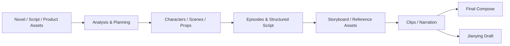

<p align="center">
  
</p>

<h1 align="center">vimage</h1>

<p align="center">
  <strong>An Agent-driven AI video creation workspace</strong><br>
  Turn novels, scripts, or product assets into character-consistent, controllable, cost-trackable short videos.
</p>

<p align="center">
  <a href="README.md"></a>
  <a href="README.en.md"></a>
  <a href="LICENSE"></a>
</p>

<p align="center">
  <a href="#what-is-vimage"><strong>About</strong></a>
  ·
  <a href="#quick-start"><strong>Quick Start</strong></a>
  ·
  <a href="#from-source-to-final-video">Pipeline</a>
  ·
  <a href="#deploy-to-a-server">Deploy</a>
  ·
  <a href="#license">License</a>
</p>

---

## What is vimage

**vimage** is a self-hosted AI video production workspace. A creation Agent moves you from text or assets through storyboard → clips → final video, while keeping human review and redo at every critical step.

Built for:

| Use case | What you get |
|----------|----------------|
| Novel / drama adaptation | Characters, scenes, props + episode scripts + storyboards and finals |
| Narrated / commentary shorts | Structured scripts with controllable narration pacing |
| Ads / product shorts | Product-reference-driven short-form generation |

Highlights:

- **End-to-end pipeline**: analysis → asset library → script / storyboard → image-to-video or reference-to-video → compose / Jianying export  
- **Visual continuity**: reuse characters, scenes, and props across shots; regenerate or roll back per clip  
- **Models & cost control**: configure text / image / video / TTS in one place; inspect usage and spend  
- **Editable delivery**: render finals or export Jianying drafts (mainland China Jianying edition)  
- **Built-in creation Agent**: side chat shares the same project state as the workbench  

Default UI language is **Chinese**; switch to English in Settings.

---

## From source to final video



Each stage can be driven by the Agent or reviewed and re-run in the workbench.

---

## Quick Start

### Option A: Docker (recommended for this customized build)

Requires [Docker](https://docs.docker.com/get-docker/) and Docker Compose.

```bash
git clone <your-repo-url> vimage
cd vimage/deploy

cp .env.example .env
```

Edit `deploy/.env`:

```dotenv
AUTH_USERNAME=admin
AUTH_PASSWORD=use-a-strong-password
AUTH_TOKEN_SECRET=generate-with-openssl-rand-hex-32
```

This repository **builds its own image by default** (`build: ../`, tag `vimage:0.10.1`):

```bash
docker compose up -d --build
```

After build you get local image `vimage:0.10.1`. To publish your own registry image:

```bash
docker tag vimage:0.10.1 ghcr.io/pans1es/vimage:0.10.1
docker push ghcr.io/pans1es/vimage:0.10.1
```

Then point Compose at `image: ghcr.io/pans1es/vimage:0.10.1` (and drop `build`) so other hosts can pull that image.

Open:

```text
http://localhost:1241
```

Sign in → configure Agent and provider API keys in **Settings** → create a project.

> Port `1241` is published on the host. If exposed publicly, use a strong password and prefer HTTPS / firewall rules.

### Option B: Local development

```bash
# Backend (repo root)
uv sync
uv run uvicorn server.app:app --host 127.0.0.1 --port 1241 --reload

# Frontend (another terminal)
cd frontend
pnpm install
pnpm dev
```

Vite usually serves at `http://localhost:5173` (proxied to local `1241`).

See [CONTRIBUTING.md](CONTRIBUTING.md) for full contributor workflow.

---

## Deploy to a server

To reach a public URL (e.g. Alibaba Cloud ECS):

1. Push this repo to Git (private Gitee / GitHub is fine)  
2. Install Docker on the server and clone your repo  
3. Follow Option A (`.env` + `build` + `compose up --build`)  
4. Open security group port `1241` (or terminate TLS on 80/443 via a reverse proxy)  
5. Visit `http://YOUR_PUBLIC_IP:1241`  

For longer-running setups, prefer `deploy/production/` (PostgreSQL). Ops details: `website/docs/ops/deployment.md`.

---

## Repository layout

| Path | Role |
|------|------|
| `frontend/` | React SPA (branding, i18n, workbench UI) |
| `server/` | FastAPI + Agent Runtime |
| `lib/` | Domain and provider core |
| `deploy/` | Default Docker deploy (SQLite) |
| `deploy/production/` | PostgreSQL production stack |
| `website/docs/` | Architecture and ops docs |

---

## Useful commands

```bash
cd deploy
docker compose ps
docker compose logs -f --tail=100 arcreel
curl http://localhost:1241/health

# After pulling updates (custom build)
git pull
docker compose up -d --build
```

---

## License

Licensed under the [GNU Affero General Public License v3.0](LICENSE); see also [NOTICE](NOTICE).

---

<p align="center">
  <strong>vimage</strong> · An inspectable, editable image-making pipeline
</p>
