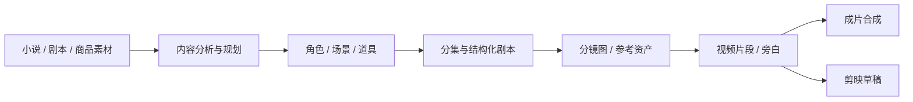

<p align="center">
  
</p>

<h1 align="center">vimage</h1>

<p align="center">
  <strong>Agent 驱动的 AI 视频创作工作台</strong><br>
  把小说、剧本或商品素材，做成角色一致、过程可控、成本可追踪的短视频。
</p>

<p align="center">
  <a href="README.md"></a>
  <a href="README.en.md"></a>
  <a href="LICENSE"></a>
</p>

<p align="center">
  <a href="#vimage-是什么"><strong>产品介绍</strong></a>
  ·
  <a href="#快速开始"><strong>快速开始</strong></a>
  ·
  <a href="#从素材到成片">创作链路</a>
  ·
  <a href="#部署到服务器">部署</a>
  ·
  <a href="#许可证">许可证</a>
</p>

---

## vimage 是什么

**vimage** 是一套可自托管的 AI 视频生产工作台：用创作 Agent 把「文字 / 素材」推进成「分镜 → 视频 → 成片」，并在每一个关键步骤保留人工审核与重做能力。

适合：

| 场景 | 你能得到什么 |
|------|----------------|
| 小说 / 漫剧改编 | 角色、场景、道具资产 + 分集剧本 + 分镜与成片 |
| 旁白 / 解说短视频 | 结构化脚本、旁白语速与画面节奏可控 |
| 广告 / 带货短片 | 商品参考图驱动的短片生成链路 |

核心能力：

- **一条完整流水线**：内容分析 → 资产库 → 剧本 / 分镜 → 图生视频或参考生视频 → 合成 / 剪映导出  
- **视觉可对齐**：角色、场景、道具跨镜头复用，单段可重生成、可回滚版本  
- **模型与费用可管**：统一配置文本 / 图像 / 视频 / TTS，生成前后可看用量与花费  
- **交付可继续剪**：可直接出成片，也可导出剪映草稿（面向中国大陆版剪映）  
- **内嵌创作 Agent**：右侧对话面板可编排任务，工作台与 Agent 共用同一套项目状态  

默认界面语言为**中文**，可在设置中切换为 English。

---

## 从素材到成片



每个阶段既可由 Agent 推动，也可在工作台里人工确认、修改或重跑。

---

## 快速开始

### 方式 A：Docker（推荐，含本仓库自定义前端）

需要已安装 [Docker](https://docs.docker.com/get-docker/) 与 Docker Compose。

```bash
git clone <你的仓库地址> vimage
cd vimage/deploy

cp .env.example .env
```

编辑 `deploy/.env`：

```dotenv
AUTH_USERNAME=admin
AUTH_PASSWORD=请设置强密码
AUTH_TOKEN_SECRET=请用 openssl rand -hex 32 生成
```

本仓库默认 **自建镜像**（`build: ../`，标签 `vimage:0.10.1`）：

```bash
docker compose up -d --build
```

构建完成后本机会有镜像 `vimage:0.10.1`。若要推到自己的镜像仓库（示例）：

```bash
docker tag vimage:0.10.1 ghcr.io/pans1es/vimage:0.10.1
docker push ghcr.io/pans1es/vimage:0.10.1
```

之后可在 Compose 里改用 `image: ghcr.io/pans1es/vimage:0.10.1`（并去掉 `build`），其他机器即可直接拉取该镜像。

浏览器打开：

```text
http://localhost:1241
```

用 `.env` 中的账号登录 → **设置** 中配置 Agent 与各模型 API Key → 创建项目开始制作。

> 端口 `1241` 会绑定到宿主机网络接口。若放到公网，请务必设强密码，并优先配合 HTTPS / 安全组限制访问。

### 方式 B：本地开发（改 UI / 调后端）

```bash
# 后端（仓库根目录）
uv sync
uv run uvicorn server.app:app --host 127.0.0.1 --port 1241 --reload

# 前端（另开终端）
cd frontend
pnpm install
pnpm dev
```

前端开发地址一般为 `http://localhost:5173`（会代理到本机 `1241`）。

更完整的开发规范见 [CONTRIBUTING.md](CONTRIBUTING.md)。

---

## 部署到服务器

把服务挂到云主机（例如阿里云 ECS）并公网访问时：

1. 将本仓库推到 Git（Gitee / GitHub 私有仓均可）  
2. 在服务器安装 Docker，clone 你的仓库  
3. 按上文「方式 A」配置 `.env` 并 `docker compose up -d --build`  
4. 安全组放行 `1241`（或前面加反向代理只开 80/443）  
5. 浏览器访问 `http://公网IP:1241`  

生产环境更建议使用 `deploy/production/`（PostgreSQL）。运维细节见仓库内文档：`website/docs/ops/deployment.md`。

---

## 目录一览

| 路径 | 说明 |
|------|------|
| `frontend/` | React 前端（品牌、i18n、工作台 UI） |
| `server/` | FastAPI 与 Agent Runtime |
| `lib/` | 领域与供应商核心库 |
| `deploy/` | Docker 默认部署（SQLite） |
| `deploy/production/` | PostgreSQL 生产编排 |
| `website/docs/` | 架构与运维文档源 |

---

## 常用命令

```bash
# 查看容器状态与日志
cd deploy
docker compose ps
docker compose logs -f --tail=100 arcreel

# 健康检查
curl http://localhost:1241/health

# 拉取代码后更新（自定义构建）
git pull
docker compose up -d --build
```

---

## 许可证

本项目遵循 [GNU Affero General Public License v3.0](LICENSE)，附加说明见 [NOTICE](NOTICE)。

---

<p align="center">
  <strong>vimage</strong> · 把构想做成可审可改的影像流水线
</p>
