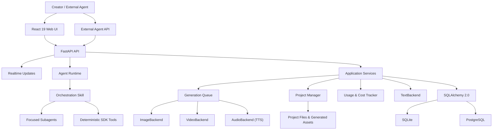
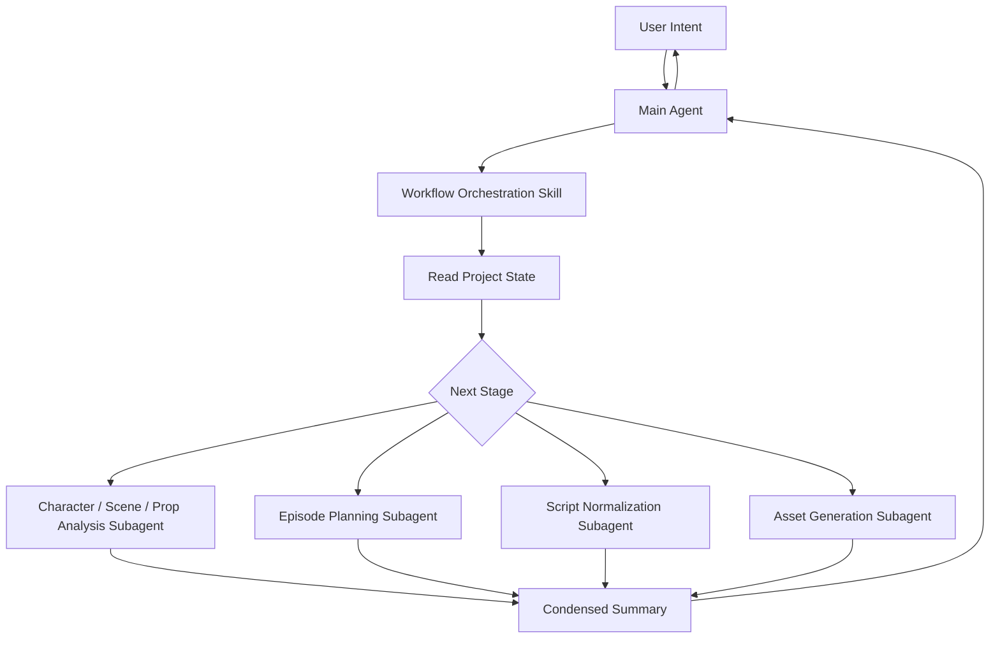
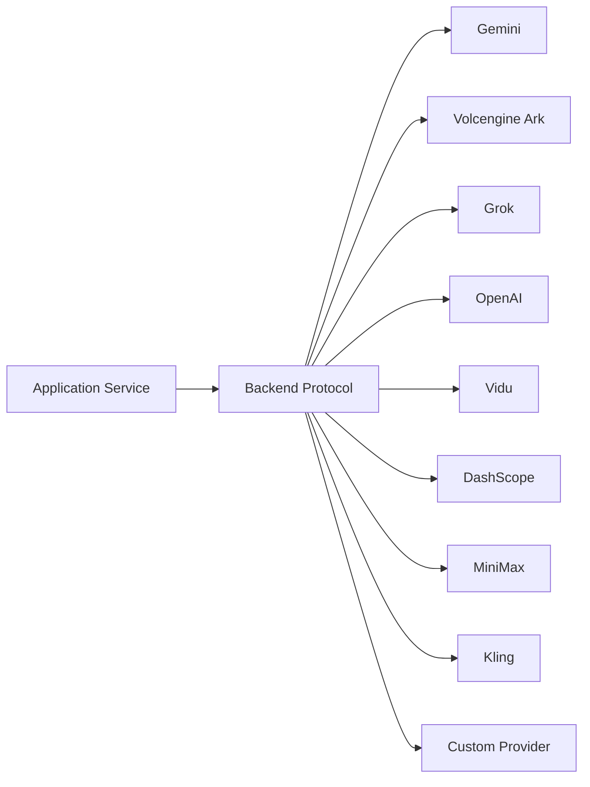

# Architecture {#architecture}

This document describes ArcReel's stable architectural boundaries, primary data flows, and extension points. It does not replace code-level API documentation or record temporary implementation plans.

## 1. Architecture Goals {#goals}

ArcReel's core goal is not to tie the product to any particular model, but to provide an AI video production pipeline that is:

- orchestratable;
- reviewable;
- resumable after interruption;
- provider-agnostic;
- cost-trackable;
- version-preserving;
- ready for continued post-production editing.

## 2. Overall Architecture {#overview}

## 3. Frontend Layer {#frontend-layer}

The frontend uses React 19 and TypeScript. Its primary responsibilities include:

- project listing and creation;
- the project workbench;
- asset previews;
- conversations with the AI assistant;
- task status;
- usage and spend statistics;
- settings and provider management;
- version history;
- project import and export.

The frontend must not handle provider credentials directly or bypass the backend to call models.

## 4. API and Realtime State {#api-and-realtime}

FastAPI provides:

- REST APIs;
- authentication;
- project and asset operations;
- task creation and queries;
- Agent conversations;
- SSE for Agent and project events;
- generation task queries;
- external API Key access.

Agent responses stream through assistant SSE. Terminal project state changes trigger UI refreshes through project event SSE, while task queries provide intermediate generation status and a fallback after disconnection. When deploying behind a reverse proxy, disable proxy buffering for SSE and configure a sufficiently long read timeout.

## 5. Agent Runtime {#agent-runtime}

The Agent Runtime is built on the Claude Agent SDK and follows an “Orchestration Skill + Focused Subagent” structure.

### 5.1 Orchestration Skill {#orchestration-skills}

It is responsible for:

- determining the project's current state;
- selecting the next step;
- calling deterministic tools;
- dispatching Subagents;
- controlling stage boundaries;
- waiting for user confirmation when needed.

The orchestration layer should not perform all content reasoning itself, because doing so would rapidly expand the main context.

### 5.2 Focused Subagents {#focused-subagents}

Each Subagent focuses on one task, such as:

- extracting characters, scenes, and props;
- splitting narration segments;
- normalizing episodic drama scripts;
- producing a structured script for one episode;
- generating assets.

Large amounts of source novel text and intermediate reasoning should remain within the Subagent whenever possible. The main Agent receives summaries and references to results.

### 5.3 Deterministic Tools {#deterministic-tools}

Deterministic operations are better handled by tools or Skills, for example:

- reading and writing project files;
- creating tasks;
- querying status;
- generating structured files;
- composing videos;
- exporting archives.

These operations should not be repeatedly delegated to a language model for free-form generation.

## 6. Application Service Layer {#service-layer}

Application services coordinate:

- projects;
- episodes;
- characters, scenes, and props;
- storyboards;
- media tasks;
- file uploads;
- project import and export;
- Jianying drafts;
- usage and spend;
- diagnostics.

The service layer should depend on stable protocols instead of exposing provider SDK-specific objects to higher layers.

## 7. Provider Abstraction {#provider-abstraction}

ArcReel uses:

- `TextBackend`
- `ImageBackend`
- `VideoBackend`
- `AudioBackend`

to provide a unified interface across providers.

The abstraction layer standardizes:

- request inputs;
- task creation;
- task polling;
- output locations;
- error handling;
- usage information;
- cost-calculation entry points.

Provider differences still exist, including:

- parameters;
- durations;
- reference image counts;
- asynchronous task states;
- failure semantics;
- billing units.

The correct approach is to encapsulate these differences in backend adapters and capability descriptions, instead of pretending that all providers are identical.

## 8. Generation Queue {#generation-queue}

Image, video, and audio tasks have different cost and latency characteristics, so they use independent concurrency channels.

Key capabilities include:

- asynchronous execution;
- RPM limits;
- independent Image / Video / Audio concurrency;
- persistent state;
- recovery after interruption;
- failure records;
- task cancellation;
- project event notifications and task status refreshes.

### 8.1 Why Tasks Must Be Persistent {#why-persistent-tasks}

Model calls can take several minutes. Tasks cannot exist only in memory, because a process restart would lose:

- submitted remote task IDs;
- current status;
- costs;
- output paths;
- error information.

### 8.2 Idempotency {#idempotency}

Task creation and retries should avoid:

- charging twice for the same shot;
- resubmitting locally after the remote task has already succeeded;
- treating a task as failed because SSE disconnected;
- creating identical generation tasks after repeated clicks.

Task identity, persistent state, and provider task IDs are essential to handling these problems.

## 9. Project and Asset Model {#project-and-asset-model}

An ArcReel project is more than a database record; it also includes media assets in the file system.

Typical contents include:

- source novels, screenplays, or merchandise assets;
- project configuration;
- character, scene, and prop definitions;
- reference images;
- storyboards;
- video clips;
- audio;
- composed output;
- version history;
- export archives.

The application data root is resolved in this order:

1. `ARCREEL_DATA_DIR`
2. compatibility variable `AI_ANIME_PROJECTS`
3. default `projects/`

The default SQLite database also resides in the application data directory.

## 10. Database {#database}

ArcReel uses the SQLAlchemy 2.0 asynchronous ORM.

### SQLite {#database-sqlite}

Suitable for:

- personal evaluation;
- local development;
- lightweight single-instance deployments.

WAL, a busy timeout, and foreign key constraints are enabled by default.

### PostgreSQL {#database-postgresql}

Suitable for:

- production environments;
- higher concurrency;
- long-running deployments;
- more mature backup and recovery.

At application startup, Alembic migrations upgrade the database to the current version.

## 11. Version History {#version-history}

Media generation is nondeterministic, so “regenerate” should not simply overwrite old files.

Version history is used to:

- compare different generation results;
- roll back;
- preserve reviewed versions;
- reduce the risk of experimentation;
- provide complete context for project archives.

The service layer should operate through a unified asset version interface rather than allowing each provider adapter to decide how files are overwritten.

## 12. Usage and Cost {#usage-and-cost}

Usage tracking spans:

- text;
- images;
- video;
- TTS;
- different providers;
- different currencies;
- estimates and actuals.

Design principles:

- provider adapters report raw usage;
- cost policies perform conversions;
- different currencies are totaled separately by default;
- whether failed tasks are billed follows the provider's semantics;
- ArcReel's records do not replace official provider invoices.

## 13. Video Composition and Jianying Export {#video-composition-and-export}

After media generation is complete, there are two output paths.

### Final Composition {#final-composition}

FFmpeg handles:

- clip concatenation;
- transitions;
- audio;
- final encoding.

### Jianying Draft {#jianying-draft}

Export an editable project structure to:

- adjust clips;
- edit subtitles;
- replace voice-over;
- add music;
- change transitions;
- make manual refinements.

The ability to continue editing is an important difference between ArcReel and generation tools that output only a single video file.

### Presentation Read Model {#presentation-read-model}

Browser preview, editable bundle download, and Jianying draft export do not derive audio, subtitles, or timing independently. They consume one presentation read model that fixes the selected video version, optional TTS version, actual media duration, original-audio policy, subtitle timing, and current or historical status. Subtitles and presentation descriptors for a current selection are materialized under `subtitles/` and `presentations/` respectively and registered in the project Artifact Manifest. Historical selections are read-only and never replace the current materialization.

A manually uploaded video without generation provenance uses an explicit raw-only branch: ArcReel preserves the original video, does not infer a provenance basis or currency, generates no TTS or subtitles, and registers no derived presentation. All three output entry points therefore share the same selection while keeping unavailable provenance distinct from verified provenance.

## 14. Authentication and External Integrations {#auth-and-integrations}

ArcReel provides:

- username and password login;
- JWT;
- API Keys with an `arc-` prefix;
- a synchronous conversation endpoint for external Agents.

API Keys should be stored as hashes and should not continue to be returned in plaintext after creation.

External Agent integrations should:

- minimize permissions;
- restrict accessible projects;
- log calls;
- support revocation;
- avoid sharing administrator passwords with third-party platforms.

## 15. Sandbox and Security Boundaries {#sandbox-and-security}

Agent tools may access:

- the file system;
- the network;
- subprocesses;
- FFmpeg;
- Bash tools.

ArcReel uses mechanisms such as `bwrap` to restrict these capabilities in supported environments. Docker Compose configures additional permissions for the sandbox, so production deployments must make a clear tradeoff between functionality and host isolation.

Security principles:

- least privilege by default;
- file and network allowlists;
- do not mount the Docker Socket;
- do not mount unnecessary host paths;
- expose only the reverse proxy externally;
- use HTTPS;
- update regularly;
- treat unknown project input as untrusted data.

## 16. Extending ArcReel with a New Provider {#extend-provider}

A complete integration of a new provider usually requires:

1. defining capability and configuration models;
2. implementing the corresponding Backend protocol;
3. standardizing error types;
4. implementing a synchronous or asynchronous task lifecycle;
5. saving remote task IDs;
6. parsing outputs and usage;
7. implementing cost policies;
8. integrating with the Settings page;
9. adding unit and integration tests;
10. updating provider documentation;
11. verifying cancellation, timeouts, and retries.

Do not implement only the happy path. Polling, timeouts, failures, and duplicate submissions for video providers are often more complex than request creation.

## 17. Extending ArcReel with a New Workflow Stage {#extend-workflow-stage}

A new stage should answer:

- what its input is;
- what its output is;
- whether it can be run repeatedly;
- how completion is determined;
- whether user confirmation is required;
- how it recovers after failure;
- whether it incurs costs;
- whether it needs version history;
- what the main Agent, Skill, Subagent, and deterministic tools are each responsible for.

A stage can be orchestrated and resumed reliably only when its completion can be determined unambiguously from project state.

## 18. Architecture Constraints {#constraints}

The following constraints should be maintained over the long term:

- the UI does not call providers directly;
- business services do not depend on objects returned by provider SDKs;
- the Agent does not construct database SQL directly;
- provider adapters do not determine product workflows;
- retries do not bypass idempotency;
- cost records are associated with generation tasks;
- project files and database state can be backed up together;
- specific model names do not enter stable domain interfaces;
- long-text reasoning does not accumulate indefinitely in the main Agent context;
- deterministic operations use tools instead of natural-language generation whenever possible.

## 19. Related Documentation {#related-docs}

- [Workflows and Modes](../guide/workflows.md)
- [Provider and Model Configuration](../guide/providers.md)
- [Deployment and Operations](../ops/deployment.md)
- [Contributing Guide](./contributing.md)
- [ADR Directory](https://github.com/ArcReel/ArcReel/tree/main/docs/adr)
