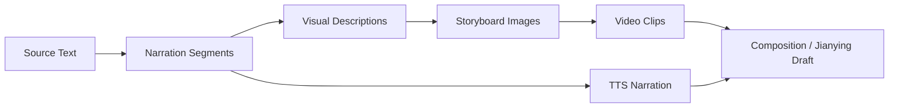
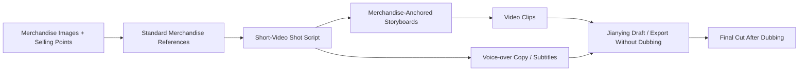

# Workflows and Modes {#workflows}

ArcReel supports multiple content sources and video generation modes. This page helps you choose the right mode before starting a project and define the review criteria for each stage.

## 1. Two Dimensions to Choose Separately {#two-dimensions}

When creating a project, distinguish between:

1. **Content Mode**: determines how the script is organized;
2. **Video generation mode**: determines whether video production is organized around storyboard images or asset reference images. Multi-grid storyboards are an optional image-generation method within Storyboard mode.

They can be combined. For example:

- Drama + Storyboard mode;
- Drama + Reference-to-video;
- Narration/Commentary + Storyboard mode;
- Ad / Short Video + Reference-to-video.

## 2. Content Sources {#content-sources}

### 2.1 Novel {#source-novel}

Best for:

- Novel adaptations;
- Novel-recap videos;
- Projects that need AI assistance with episode planning and structured scripts.

ArcReel will process:

- Characters and aliases;
- Key scenes;
- Key props;
- Plot stages;
- Episode boundaries;
- Shot-oriented descriptions.

Recommendations:

- Do not upload an entire long novel for your first attempt;
- Start with a self-contained chapter to validate the style and providers;
- Confirm character assets before expanding the production scope.

### 2.2 Finished Screenplay {#source-screenplay}

Best for projects that:

- Already have dialogue, voice-over, and scene directions;
- Need to preserve the author's original text as closely as possible;
- Only need asset design, storyboarding, and media generation.

Core principles:

- Dialogue and voice-over should be preserved verbatim whenever possible;
- Characters should be based on the author's character list and screenplay content;
- Extras and establishing shots should not automatically expand into long-lived character assets;
- The focus is normalization and shot production, not rewriting.

### 2.3 Merchandise Materials {#source-product-material}

Best for:

- Shoppable short videos;
- Merchandise demos;
- Ad scripts;
- Branded short videos.

Prepare:

- Front, side, detail, and in-use merchandise images;
- Core selling points;
- Target audience;
- Prohibited claims;
- Brand visual requirements;
- Target duration and publishing platform.

Ad / Short Video projects should establish stable merchandise reference assets before generating shots in context.

## 3. Content Modes {#content-modes}

### 3.1 Narration/Commentary {#narration-mode}

#### Characteristics {#narration-traits}

- Narration is the primary vehicle for information;
- Visuals support the narrative and atmosphere;
- Content is split by reading rhythm and semantic pauses;
- Better suited to fast-paced vertical short videos.

#### Recommended Workflow {#narration-flow}

#### Review Focus {#narration-review}

- Whether each narration segment is too long;
- Whether each visual conveys one clear point;
- Whether the visuals merely restate the narration mechanically;
- TTS pronunciation of proper nouns and character names;
- Whether the narration and visuals have matching durations.

#### Best For {#narration-fit}

- Novel-recap videos;
- History, storytelling, and educational content;
- Narration-led merchandise introductions;
- Projects with limited lip-sync requirements.

### 3.2 Drama {#drama-mode}

#### Characteristics {#drama-traits}

- Scenes, characters, dialogue, and action form the primary structure;
- Greater emphasis on character consistency and shot continuity;
- Suitable for AI motion comics, narrative shorts, and animated adaptations of finished screenplays.

#### Recommended Workflow {#drama-flow}

#### Review Focus {#drama-review}

- Whether each episode has a complete objective and emotional arc;
- Whether character appearances and costumes remain continuous;
- Whether spatial relationships between shots remain stable;
- Whether dialogue, actions, and shot duration align;
- Whether eyelines and movement direction remain continuous across adjacent shots.

#### Best For {#drama-fit}

- Novel adaptations;
- Serialized AI motion comics;
- Character-driven narrative shorts;
- Animating existing dialogue-based screenplays.

### 3.3 Ad / Short Video {#ad-mode}

#### Characteristics {#ad-traits}

- A clearly defined target duration;
- Shots organized around selling points, use cases, and calls to action;
- Merchandise fidelity and reference consistency take priority;
- Can generate voice-over copy, subtitles, and a Jianying draft, with dubbing completed after export.

#### Recommended Workflow {#ad-flow}

#### Review Focus {#ad-review}

- Whether the merchandise's shape, Logo, colors, and structure are accurate;
- Whether selling points are factually supported;
- Whether shots rely too heavily on the generation model to fill in merchandise details;
- Whether the opening quickly communicates the merchandise's value;
- Whether the ending has a clear call to action;
- Whether voice-over copy and subtitles comply with platform rules.

## 4. Video Generation Modes {#video-production-routes}

### 4.1 Storyboard Image-to-Video {#storyboard-image-route}

Uses a single storyboard image as the video input.

#### Advantages {#storyboard-image-pros}

- The most straightforward workflow;
- Usually has the broadest provider support;
- Makes it easy to redo individual shots;
- Clearly separates storyboard review from video generation.

#### Limitations {#storyboard-image-cons}

- Primarily constrains the opening frame;
- The model may change characters and details during motion;
- The final frame may not transition well into the next shot.

#### Recommended For {#storyboard-image-fit}

- Most first-time projects;
- Projects with high-quality storyboards;
- Projects where each shot is relatively independent;
- Projects that need to switch providers quickly.

### 4.2 Multi-grid Storyboards Within Storyboard Mode {#grid-storyboard-route}

Multi-grid storyboards are not a separate generation mode but an image-generation method within Storyboard mode. It generates multiple shots from the same passage together on one or more multi-grid storyboards, then automatically splits each grid into an individual storyboard image for each shot and generates each video separately. The video model still receives the individual storyboard image after splitting.

Multi-grid storyboards automatically use square 2×2 / 3×3 grids based on the number of shots. Each cell uses the same aspect ratio as the project video; when there are more shots, they are divided across multiple multi-grid storyboards according to the grid capacity. Denser 4×4 / 5×5 grids are available only when the image model's resolution tier is configured as 4K—the more cells a multi-grid storyboard contains, the lower the resolution of each cell, and dense grids at lower resolution tiers will degrade downstream video quality.

#### Advantages {#grid-storyboard-pros}

- Characters, scenes, and visual style are easier to keep consistent within the same multi-grid storyboard;
- Lets you review the composition and rhythm of a group of consecutive shots at once;
- Suitable for establishing a unified visual direction before generating videos shot by shot.

#### Limitations {#grid-storyboard-cons}

- Multi-grid storyboard layouts and splitting rules add complexity;
- Each cell may be less sharp;
- Not available for the Reference-to-video workflow or Ad / Short Video projects.

#### Recommended For {#grid-storyboard-fit}

- Consecutive shots that contain the same characters, scenes, or props;
- Projects where cross-shot consistency matters more than the freedom of an individual storyboard;
- Reviewing composition, costumes, and overall visual style in groups;
- Long-form projects that need to reduce visual drift between batches.

### 4.3 Reference-to-Video {#reference-video-route}

Instead of using an ordinary storyboard as the sole input, the workflow directly provides character, scene, prop, or merchandise reference assets.

#### Advantages {#reference-video-pros}

- Makes more direct use of long-lived assets;
- Suits video models that support multiple reference images;
- Can eliminate the ordinary storyboard generation step;
- Helps anchor character or merchandise identity.

#### Limitations {#reference-video-cons}

- Not supported by every provider;
- Reference image count, type, and weighting limits vary;
- Requires better prompts and asset selection;
- Composition may be less controllable without an explicit storyboard.

#### Recommended For {#reference-video-fit}

- Models with mature Reference-to-video capabilities;
- High-quality character and merchandise assets;
- Projects where identity consistency is the priority;
- Projects that want fewer intermediate storyboard steps.

## 5. Mode Selection Table {#mode-selection-table}

| Requirement | Recommended Content Mode | Recommended video generation mode |
|---|---|---|
| Novel recaps and narration-led content | Narration/Commentary | Storyboard mode |
| Continuous narratives and character dialogue | Drama | Storyboard mode (with multi-grid storyboards) or Reference-to-video mode |
| A complete existing screenplay | Drama | Storyboard mode |
| Merchandise structure must remain stable | Ad / Short Video | Prefer Reference-to-video |
| Strong cross-shot consistency requirements | Narration/Commentary or Drama | Storyboard mode (with multi-grid storyboards) |
| First ArcReel trial | Any | Storyboard mode |
| Limited provider support | Any | Storyboard mode |
| An established library of high-quality character assets | Drama | Reference-to-video |

## 6. Standard Production Stages {#production-stages}

Regardless of the selected mode, retain the following stages.

### Stage 1: Project Goals {#stage-project-goal}

Define:

- Publishing platform;
- Aspect ratio;
- Target duration;
- Audience;
- Visual style;
- Budget limit;
- Whether narration is needed;
- Whether further editing in Jianying is needed.

### Stage 2: Content Structure {#stage-content-structure}

Confirm:

- The sequence of plot points or selling points;
- Episode boundaries;
- The purpose of each shot;
- The scope of characters, scenes, and props;
- Content that must not be rewritten.

### Stage 3: Reference Assets {#stage-reference-assets}

Confirm:

- Main characters;
- Recurring costumes;
- Scenes;
- Key props;
- Merchandise;
- Style references.

### Stage 4: Small Sample {#stage-sample-clips}

Start by producing:

- 1–2 characters;
- 2–4 storyboards;
- 1–2 video clips;
- A short narration segment.

Scale up batch production only after approving the sample.

### Stage 5: Batch Production {#stage-batch-production}

Before starting, confirm:

- Concurrency and RPM;
- Cost estimate;
- Provider quota;
- Failure retry strategy;
- Disk space.

#### Current, Stale, Missing, and Blocked Artifacts {#artifact-currency}

ArcReel determines an artifact's state from the direct inputs used to generate it:

- **Current**: The formal artifact matches the current project, script, and selected version;
- **Stale**: The formal artifact still exists and can be previewed or exported, but a related input changed after it was generated;
- **Missing**: No usable formal artifact exists, so one must be generated;
- **Blocked**: A project reference or artifact record is damaged and must be repaired first. ArcReel will not treat it as missing and automatically pay to regenerate it.

By default, batch generation fills only missing items; both current and stale artifacts are preserved. After changing a prompt, character, narration, or another input, explicitly regenerate the affected shots if you want to refresh existing results. A same-named file in the project directory is not, by itself, a formal artifact. The project must retain either the artifact reference in its script or a verifiable version record.

### Stage 6: Quality Control and Export {#stage-qa-and-export}

Check:

- Character consistency;
- Scene continuity;
- Actions and eyelines;
- Narration synchronization;
- Subtitles;
- Clip order;
- Total duration;
- Final resolution;
- Whether the Jianying export can be opened.

## 7. Review Gates {#review-gates}

ArcReel's advantage is not “skipping review,” but placing review where the cost of rework is lower.

| Review Point | What to Do When It Fails | What Not to Do |
|---|---|---|
| Content analysis | Correct the characters, scenes, props, and episode plan | Continue generating all character images |
| Character assets | Redo the character design or description | Batch-generate storyboards with an incorrect character |
| Small storyboard sample | Correct composition and style | Generate the entire episode's videos immediately |
| Small video sample | Adjust the model, parameters, and action descriptions | Repeatedly test expensive models without a plan |
| Narration audition | Correct the voice, pace, and text | Generate every audio track at once |
| Final video preview | Adjust the order, duration, and transitions | Publish an unchecked version immediately |

## 8. Consistency Practices {#consistency-practices}

### Characters {#consistency-characters}

- Keep age, hairstyle, body type, and core costume descriptions fixed;
- Minimize unnecessary backgrounds in character assets;
- Give distinct identifying features to different main characters;
- Treat costume changes as explicit story states, not random prompt variations.

### Scenes {#consistency-scenes}

- Establish reference assets for important scenes;
- Fix the spatial orientation and main decor;
- Avoid unnecessary changes in lighting and time of day within the same passage;
- Track where characters are positioned in the space.

### Props and Merchandise {#consistency-props}

- Create prop assets for story-critical items;
- Prefer real merchandise photos from multiple angles;
- Do not let the model invent important text, Logo details, or structures;
- When details drift, redo the affected shot first instead of concealing the problem with later shots.

## 9. Cost-Control Practices {#cost-control-practices}

- Start with low-cost samples, then move to high-quality batch production;
- Use high-quality models for character design and key cover images;
- Use more balanced models for ordinary storyboards;
- Confirm images before generating videos;
- Redo individual failed shots separately;
- Review the cost estimate before each batch;
- Do not submit an entire episode while the model configuration is uncertain;
- Save reusable character and scene assets.

## 10. Definition of Done {#definition-of-done}

An episode or short video is complete only when it meets at least the following conditions:

- The content structure has been confirmed;
- The main assets have been confirmed;
- Every shot has a clear purpose;
- Characters and merchandise have no obvious identity drift;
- Video clips transition cleanly;
- Narration and subtitles have been proofread;
- Actual costs have been reviewed;
- The final video or Jianying draft opens correctly;
- The project has been archived or backed up.
